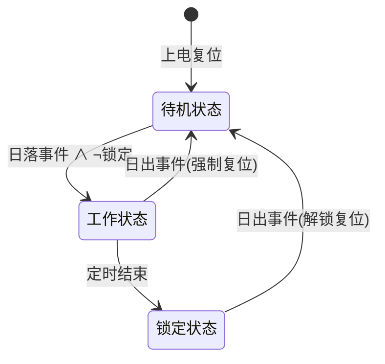

# 太阳能草坪灯系统架构与状态机设计

> 本文围绕太阳能草坪灯光控时控电路的**系统级架构**展开，从需求分析出发，建立状态机模型，阐述光控检测、边沿识别与定时逻辑的协同工作机制，并给出基于 Multisim 的仿真验证结果。

---

## 1. 课题背景与设计目标

在"双碳"战略引领下，太阳能草坪灯作为零布线、零电费的户外照明方案，在公园、校园、住宅庭院等场景具有广阔的应用前景。然而，传统太阳能草坪灯普遍存在以下问题：

- **光控精度不足**：单一阈值比较器在晨昏临界照度附近容易抖动误触发；
- **时控功能缺失**：多数廉价方案仅靠光控通断，无法实现"亮多久"的定时关断；
- **逻辑不可靠**：缺乏状态锁定机制，夜间光照波动可能导致重复触发或误关断。

本文的设计目标是构建一套**光控 + 时控**协同工作的控制电路，实现以下核心工作循环：

> **天黑开灯 → 定时关闭 → 天亮解锁 → 白天待机**

---

## 2. 系统总体架构

### 2.1 模块划分

系统从功能上划分为**电源系统**和**负载系统**两大部分，共包含以下功能模块：

| 子系统 | 模块 | 核心功能 |
|:---:|:---|:---|
| 电源系统 | 光伏恒流恒压充电模块 | 太阳能板输入 → Buck-Boost CC/CV → 2S 锂电 |
| 电源系统 | 锂电池保护模块 | 过充/过放/过流/短路保护 |
| 电源系统 | LDO 降压稳压模块 | 8.4V → +5V / +3V 双路稳压 |
| 电源系统 | LED 恒流驱动模块 | 2S 电池 → Buck 恒流 → LED 负载 |
| 负载系统 | 光敏电阻采样模块 | 环境光照 → 分压电压信号 |
| 负载系统 | 电压比较与阈值调节模块 | 模拟信号 → 数字事件（日出/日落） |
| 负载系统 | 边沿识别逻辑模块 | 事件脉冲 → 状态转换触发 |
| 负载系统 | 定时器模块 | 可调延时 → 定时关断 |
| 负载系统 | LED 驱动与负载模块 | 逻辑信号 → 光耦隔离 → LED 通断 |

### 2.2 信号流

系统的信号流可概括为：

```
光照变化 → 光敏电阻分压 → 双比较器(迟滞) → 边沿识别(D触发器+与非门)
                                                    ↓
                                            555定时器触发/锁定
                                                    ↓
                                            光耦隔离 → LED开关
```

---

## 3. 状态机模型

### 3.1 三状态定义

系统采用有限状态机（FSM）建模，定义三个状态：

| 状态 | 编码 | 描述 |
|:---:|:---:|:---|
| 待机状态 | S0 | 白天，光伏充电，逻辑电路待机 |
| 工作状态 | S1 | 天黑触发，定时器计时中，LED 点亮 |
| 锁定状态 | S2 | 定时结束，LED 关闭，禁止重复触发 |

> 日出事件直接将系统从工作状态或锁定状态复位到待机状态，无需独立的"复位状态"。这与论文中的状态机模型一致：系统在识别到天亮后，强制终止定时或重置定时器状态，重置锁定状态寄存器，完成从"工作状态"或"锁定状态"向"待机状态"的转变。

### 3.2 状态转换图



### 3.3 状态转换条件

状态转换的逻辑表达式如下：

$$S_0 \xrightarrow{\text{Sunset} \land \lnot\text{LOCK}} S_1$$

$$S_1 \xrightarrow{\text{Timer\_OUT}} S_2$$

$$S_1 \xrightarrow{\text{Sunrise}} S_0$$

$$S_2 \xrightarrow{\text{Sunrise}} S_0$$

其中：
- **Sunset**：光敏电阻检测到照度下降穿越开启阈值（天黑事件）；
- **Sunrise**：光敏电阻检测到照度上升穿越关断阈值（天亮事件）；
- **Timer_OUT**：ICM7555 定时器计时结束信号；
- **LOCK**：锁定标志，防止夜间重复触发。

---

## 4. 光控检测电路设计

### 4.1 光敏电阻模型

光敏电阻的阻值与照度之间满足幂律关系：

$$R_{LDR}(L) = A \cdot L^{-\gamma}$$

其中 $L$ 为照度（Lux），$\gamma$ 为光敏系数（典型值 0.6–0.7），$A$ 为标定系数。

本文选用 GT36549 型光敏电阻，其关键参数为：

| 参数 | 数值 |
|:---|:---|
| 暗电阻 $R_{dark}$ | 50 MΩ |
| 10 Lux 下阻值 | 100 kΩ |
| 光敏系数 $\gamma$ | 0.65 |

由 $R(10\text{Lux}) = 100\text{k}\Omega$ 可标定系数：

$$A = R_{10\text{Lux}} \cdot 10^{\gamma} = 100\text{k}\Omega \times 10^{0.65} \approx 446.7\text{k}\Omega$$

### 4.2 分压电路

采用光敏电阻做上拉、固定电阻做下拉的分压结构：

$$V_{LDR} = V_{CC} \cdot \frac{R_{fixed}}{R_{fixed} + R_{LDR}(L)}$$

选取 $R_{fixed} = 1\text{M}\Omega$，当照度从白天（>1000 Lux）变化到夜间（<1 Lux）时，$V_{LDR}$ 从接近 $V_{CC}$ 下降到接近 0V。

### 4.3 双比较器 + 迟滞设计

为解决单一阈值在临界照度下的抖动问题，本文采用**双比较器 + 迟滞反馈**方案：

- **比较器 A（日落检测）**：当 $V_{LDR} < V_{ON}$ 时输出有效，表示"足够暗"；
- **比较器 B（日出检测）**：当 $V_{LDR} > V_{OFF}$ 时输出有效，表示"足够亮"。

迟滞通过在比较器输出到输入端引入正反馈电阻实现。以 LM393LVDDFR 为例，选取反馈电阻 $R_{FB} = 1\text{M}\Omega$、输入电阻 $R_{in} = 1\text{k}\Omega$，迟滞宽度控制在：

$$\Delta V_{hys} \approx V_{CC} \cdot \frac{R_{in}}{R_{FB}} = 5\text{V} \times \frac{1\text{k}\Omega}{1\text{M}\Omega} = 5\text{mV}$$

这一迟滞量足以抑制光照波动引起的误触发，同时不会过度影响阈值精度。

---

## 5. 边沿识别与逻辑控制

### 5.1 边沿检测原理

光控比较器输出的是**电平信号**（持续的天黑/天亮状态），而定时器需要的是**脉冲信号**（仅在状态变化瞬间触发）。因此需要边沿识别电路将电平变化转换为窄脉冲。

本文采用 **D 触发器 + 与非门** 构成下降沿检测电路：

- 比较器输出接入 D 触发器的时钟端；
- D 触发器的 $\overline{Q}$ 端与输入信号经与非门产生负脉冲。

### 5.2 器件选型

| 器件 | 型号 | 功能 |
|:---|:---|:---|
| D 触发器 | SN74HC74DR | 双路 D 触发器，边沿检测与状态锁存 |
| 与非门 | SN74HC00DR | 四路与非门，逻辑组合 |
| 反相器 | SN74HC04DR | 六路反相器，信号取反 |

### 5.3 信号定义

边沿识别模块的输入输出信号如下：

| 信号名 | 方向 | 有效电平 | 含义 |
|:---|:---:|:---:|:---|
| SIGN_LIGHT_CLOSE | 输入 | 高 | 天亮事件（比较器 B 输出） |
| SIGN_DARK_OPEN | 输入 | 高 | 天黑事件（比较器 A 输出） |
| SIGN_TIMER_ENABLED | 输入 | 高 | 定时器正在计时 |
| SIGN_TRIG_ON | 输出 | 低（负脉冲） | 触发定时器开始计时 |
| SIGN_TIMER_RESET | 输出 | 低（负脉冲） | 强制重置定时器 |
| SIGN_SUNRISE_RESET | 输出 | 低（负脉冲） | 日出复位所有状态 |

---

## 6. 定时器模块设计

### 6.1 ICM7555 单稳态改造

本文选用 **ICM7555**（CMOS 版 555 定时器）实现定时功能。相比传统双极型 555，ICM7555 具有极低的输入电流，可显著提高长时间计时的准确性，满足课题对长延时精度的要求。

在经典 555 单稳态电路基础上进行两项改造：

1. **可调定时电阻**：通过并联不同阻值的电阻网络，实现多档定时时长选择；
2. **锁定控制**：将 RST 引脚通过 D 触发器构成的异步锁定电路控制，实现定时结束后的状态锁定。

### 6.2 定时公式

555 定时器单稳态的定时时长为：

$$t_w = \ln 3 \cdot R_T \cdot C_T \approx 1.1 \cdot R_T \cdot C_T$$

其中 $R_T$ 为定时网络等效电阻，$C_T$ 为定时电容。

### 6.3 多档定时组合

通过开关选择并联不同阻值的定时电阻，可实现多种定时时长组合。论文中三个定时电阻分别命名为 R_TIMER1_18min、R_TIMER2_8m30s、R_TIMER3_5m45s，对应其各自贡献的定时时长：

| R_TIMER1_18min | R_TIMER2_8m30s | R_TIMER3_5m45s | 等效电容 | 理论定时 |
|:---:|:---:|:---:|:---|:---|
| ○ | × | × | 940μF | 10.34s |
| ○ | ○ | × | 940μF | 10.24s |
| ○ | ○ | ○ | 940μF | 10.14s |
| × | ○ | ○ | 940μF | 8min37s |
| × | × | ○ | 940μF | 17min14s |
| × | ○ | × | 940μF | 17min14s |
| ○ | × | ○ | 940μF | 8min30s |

> ○ 表示接入，× 表示未接入。仿真采用短时参数，实际使用通过比例缩放对应 2~8 小时定时需求。

### 6.4 锁定机制

555 定时器输出信号 `Sign_LED_Enabled` 同时作为时钟信号接入 D 触发器 U9A。当定时结束时：

1. 555 输出翻转，产生下降沿；
2. D 触发器捕获该下降沿，$\overline{Q}$ 输出低电平；
3. 该低电平通过与非门拉低 555 的 RST 引脚，锁定 555；
4. 系统进入锁定状态，禁止再次触发。

只有当日出事件 `Sign_Sunrise_Reset` 到来时，D 触发器被异步清零，锁定解除，系统回到待机状态。

---

## 7. 逻辑电路板 3D 模型

以下为逻辑电路板的 STEP 3D 模型，包含光控检测、边沿识别、定时器等核心逻辑模块的 PCB 布局：

<div class="step-viewer-container"
     data-src="/assets/models/LogicBoard.step">
  <div class="step-canvas-wrapper">
    <div class="step-loading">Loading 3D model...</div>
  </div>
  <div class="step-controls">
    <button class="step-btn-reset">🔄 Reset View</button>
    <button class="step-btn-autorotate">🔄 Auto Rotate</button>
    <button class="step-btn-wireframe">🔲 Wireframe</button>
    <span class="step-info"></span>
  </div>
</div>

> 💡 可通过鼠标左键拖动旋转、滚轮缩放、右键平移查看模型细节。

---

## 8. 仿真验证结果

### 8.1 光控迟滞验证

在 Multisim 中对光敏电阻阻值进行"先下降后上升再下降"的模拟，观察比较器输出：

- 比较器输出在阈值附近无抖动，迟滞特性有效抑制了输入电压波动；
- 日落与日出过程被正确识别，分别给出负脉冲。

### 8.2 时控逻辑验证

- 定时器在触发后进入计时状态，达到设定延时后输出翻转信号；
- 并联不同定时电阻可改变定时时长，误差在 5% 以内；
- 锁定机制正常工作，定时结束后 555 被锁定，不再响应光控触发。

### 8.3 负载控制验证

隔离光耦在收到 555 控制信号后，负载侧 MOSFET 开关正常通断，LED 负载受控工作。

---

## 9. 小结

本文建立了太阳能草坪灯控制系统的三状态有限状态机模型，设计了光控检测（双比较器 + 迟滞）、边沿识别（D 触发器 + 与非门）和定时控制（ICM7555 单稳态 + 锁定）三大核心逻辑模块。Multisim 仿真验证了系统在典型工况下的工作可靠性，为后续硬件实现奠定了逻辑基础。

---

